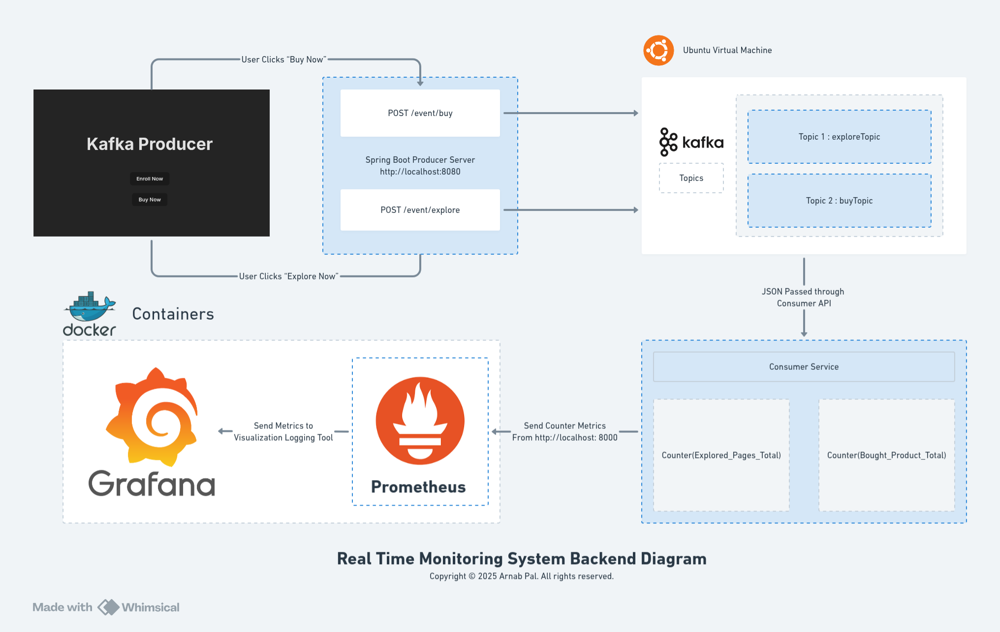

# Real Time Monitoring System

**Purpose**  
Build a real-time monitoring system to track application metrics, infrastructure health, and business events across microservices. The system provides:  
- Real-time dashboards for Kafka message throughput (explore/buy events)  
- Service performance metrics (Spring Boot apps)  
- Container resource monitoring (Docker)  
- End-user facing dashboard (ReactJS)  

---

### Stacks
- Java
- Spring Boot
- Kafka
- ReactJS
- Python
- Docker
- Prometheus
- Grafana

## Access Endpoints

|Component|URL|
|---|---|
|React Dashboard|[http://localhost:5173](http://localhost:5173/)|
|Grafana|[http://localhost:3000](http://localhost:3000/)|
|Prometheus|[http://localhost:9090](http://localhost:9090/)|
|Spring Boot|[http://localhost:8080](http://localhost:8080)|
|Python Consumer|[http://localhost:8000/metrics](http://localhost:8000/metrics)|

### Diagram

